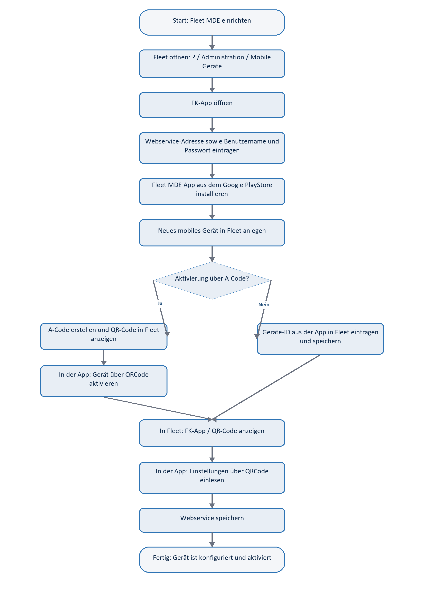
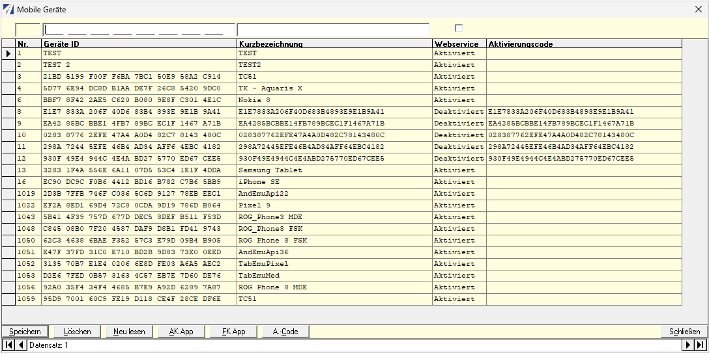
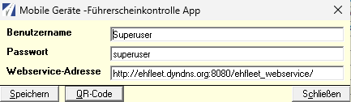
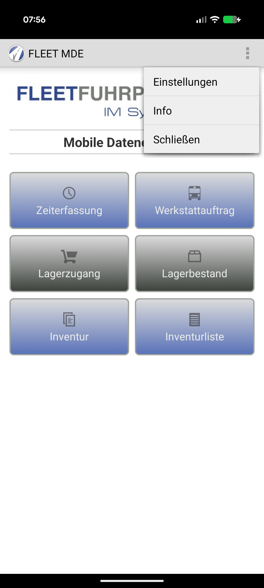
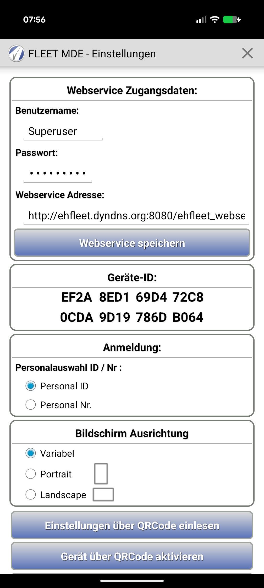
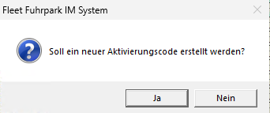
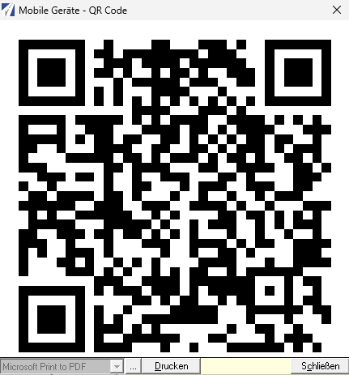
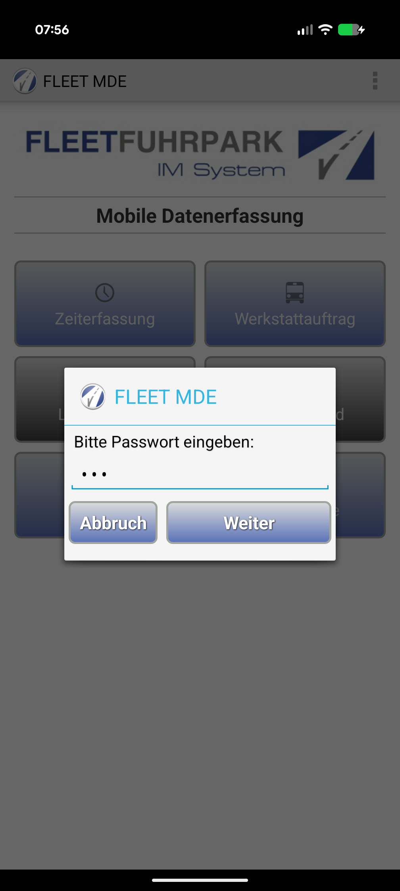
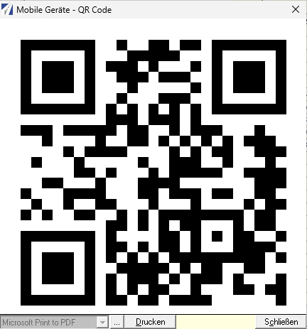

# Einrichtung Fleet MDE

Diese Anleitung beschreibt die Einrichtung eines mobilen Geräts für die Fleet MDE App. Sie umfasst die Hinterlegung der Webservice-Zugangsdaten in Fleet, die Installation der App, die Anlage des mobilen Geräts, die Aktivierung per Aktivierungscode und die Übernahme der Konfiguration per QR-Code.

[Handbuch als Word-Datei herunterladen](assets/downloads/Fleet-MDE-Handbuch.docx)

!!! important "Standardpasswort"
    Das Standardpasswort für die Fleet MDE App Einstellungen lautet: `_EHFleet_`

## Kurzüberblick

| Bereich | Aktion |
| --- | --- |
| Fleet-Anwendung | Webservice-Adresse, Benutzername und Passwort über **FK-App** hinterlegen |
| Android-Gerät | Fleet MDE App aus dem Google PlayStore installieren |
| Fleet-Anwendung | Mobiles Gerät unter **Mobile Geräte** anlegen |
| Fleet-Anwendung | Optional Aktivierungscode über **A-Code** erzeugen |
| Fleet MDE App | Einstellungen mit Standardpasswort `_EHFleet_` öffnen |
| Fleet MDE App | Aktivierungscode-QR-Code und anschließend Konfigurations-QR-Code scannen |

## Ablaufdiagramm



??? note "Mermaid-Quelle"
    ```mermaid
    flowchart TD
        A([Start: Fleet MDE einrichten]) --> B[Fleet öffnen: ? / Administration / Mobile Geräte]
        B --> C[FK-App öffnen]
        C --> D[Webservice-Adresse sowie Benutzername und Passwort eintragen]
        D --> E[Konfigurationsdaten speichern]
        E --> F[Fleet MDE App aus dem Google PlayStore installieren]
        F --> G[Neues mobiles Gerät in Fleet anlegen]
        G --> H{Aktivierung über A-Code?}
        H -- Ja --> I[A-Code erstellen]
        I --> J[A-Code / QR-Code in Fleet anzeigen]
        J --> K[In der App: Einstellungen öffnen und Standardpasswort _EHFleet_ eingeben]
        K --> L[Gerät über QRCode aktivieren]
        H -- Nein --> M[Geräte-ID aus der App in Fleet eintragen]
        M --> N[Gerät in Fleet speichern]
        L --> O[In Fleet FK-App / QR-Code anzeigen]
        N --> O
        O --> P[In der App: Einstellungen über QRCode einlesen]
        P --> Q[Webservice speichern]
        Q --> R([Fertig: Gerät ist konfiguriert und aktiviert])
    ```

## 1. Webservice-Zugangsdaten in Fleet hinterlegen

1. Fleet öffnen.
2. Den Bereich **? / Administration / Mobile Geräte** öffnen.
3. In der Maske **Mobile Geräte** die Schaltfläche **FK-App** auswählen.
4. Benutzername, Passwort und Webservice-Adresse eintragen.
5. Mit **Speichern** übernehmen.





## 2. Fleet MDE App installieren

1. Auf dem Android-Gerät den Google PlayStore öffnen.
2. Nach **Fleet MDE** suchen.
3. Die Fleet MDE App installieren.
4. Die App nach der Installation starten.



## 3. Mobiles Gerät in Fleet anlegen

1. In Fleet erneut **? / Administration / Mobile Geräte** öffnen.
2. Über **Neu lesen** oder die entsprechende Eingabe ein neues Gerät vorbereiten.
3. Entweder die **Geräte-ID** aus der App in Fleet eintragen oder einen Aktivierungscode erstellen.
4. Den Datensatz speichern.

Die Geräte-ID ist in der Fleet MDE App unter **Einstellungen** sichtbar.



## 4. Aktivierungscode erstellen

Dieser Schritt ist erforderlich, wenn das Gerät nicht direkt über die Geräte-ID in Fleet eingetragen wird.

1. In Fleet in der Maske **Mobile Geräte** den gewünschten Gerätedatensatz markieren.
2. Die Schaltfläche **A-Code** auswählen.
3. Die Abfrage **Soll ein neuer Aktivierungscode erstellt werden?** mit **Ja** bestätigen.
4. Danach über **A-Code > QR-Code** den QR-Code für die Aktivierung anzeigen.





## 5. App-Einstellungen öffnen

1. In der Fleet MDE App oben rechts das Menü öffnen.
2. **Einstellungen** auswählen.
3. Bei der Passwortabfrage das Standardpasswort `_EHFleet_` eingeben.
4. Mit **Weiter** bestätigen.




## 6. Gerät per A-Code aktivieren

Dieser Schritt wird nur benötigt, wenn in Fleet ein Aktivierungscode erstellt wurde.

1. In den Fleet MDE Einstellungen die Schaltfläche **Gerät über QRCode aktivieren** auswählen.
2. Den QR-Code aus Fleet scannen: **A-Code > QR-Code**.
3. Die Aktivierung abwarten.
4. Anschließend mit der Konfiguration fortfahren.


## 7. Konfiguration per QR-Code einlesen

1. In Fleet in der Maske **Mobile Geräte** die Schaltfläche **FK-App** auswählen.
2. In der FK-App-Maske die Schaltfläche **QR-Code** auswählen.
3. In der Fleet MDE App in den Einstellungen **Einstellungen über QRCode einlesen** auswählen.
4. Den QR-Code aus Fleet scannen.
5. In der App **Webservice speichern** auswählen.



## 8. Abschlussprüfung

Nach der Einrichtung prüfen:

- Die Webservice-Adresse ist in der App eingetragen.
- Benutzername und Passwort sind in der App hinterlegt.
- Die Geräte-ID ist in Fleet dem richtigen mobilen Gerät zugeordnet.
- Der Status in Fleet ist für den Webservice aktiv.
- Die App kann Daten über den Webservice abrufen oder übertragen.

## Häufige Fehlerquellen

| Fehlerbild | Prüfung |
| --- | --- |
| App kann keine Verbindung herstellen | Webservice-Adresse, Benutzername und Passwort prüfen |
| Gerät ist nicht bekannt | Geräte-ID in Fleet prüfen oder A-Code erneut erzeugen |
| QR-Code wird nicht erkannt | Bildschirmhelligkeit erhöhen und QR-Code vollständig im Scanner erfassen |
| Einstellungen nicht zugänglich | Standardpasswort `_EHFleet_` erneut eingeben |
| Aktivierung schlägt fehl | Gerätedatensatz in Fleet speichern und neuen A-Code erzeugen |

